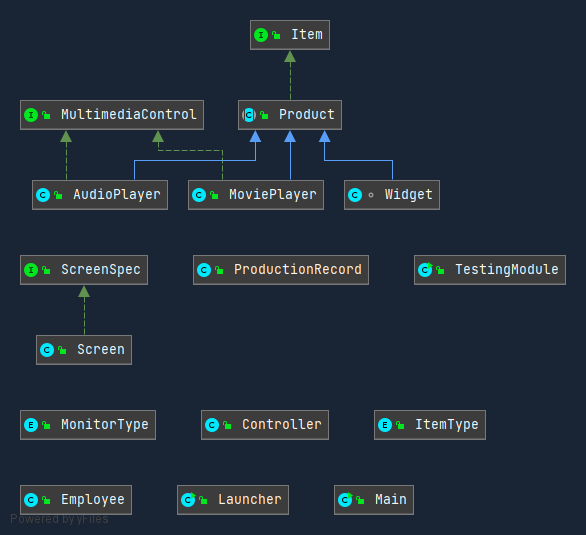

# Production Project

The Production Project uses Javafx and the H2 database. Currently, it allows for the user to input the name, manufacturer, and type of a product in a Gui and then save that to a database. The skeleton of the project was made by Professor Vanselow at FGCU, the remainder of the project is made by me, Jairo Garciga. I am currently working on it and plan to complete it by early decemeber. This project has improved my ability of analyze and address problems in my code. I made it for an assignment for COP 3003, but I have tried my best to make it my own. Receiving a good score on this assignment is less important than learning the process and aquiring the skills that the assignment is teaching me. 
https://jgar157.github.io/ProductionProject/index-files/index-1.html

## Demonstration

## Diagram

## Built With

Intellij  
H2 Database   
Gradle  
JavaFx

## Author

Jairo Garciga

## Getting Started

In order to run the program you must run the jar file located in  
ProductionProject/build/libs/ProductionProject-1.0.jar

## Contributing

If you're interested in contributing to this project please  
contact me at jgarciga0822@eagle.fgcu.edu

## Acknowledgments

W3Schools  
Professor Vanselow
Vladimir Hardy
